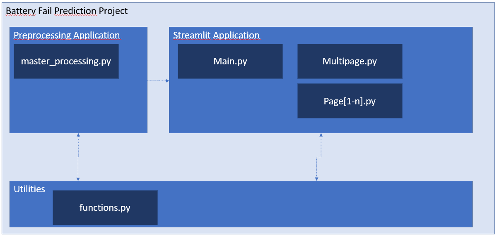

# battery_failure_predictions
Battery Failure Predictions based on NASA Data

## Authors
Markus Friemann,
Daniel Danyali,
Sebastian Schmorleiz,
Daniel Müller

# Project Structure

* data - includes the data files for analysis parts
 * CSV - source data in csv form
 * Prepared - Includes prepared data with every step
* descriptions - includes the html descriptions of each data file
* models - Includes trained models for preprocessing and ML
* first_step.ipynb - prepares the source data
* functions.py - A modul with some useful functions

## Fragestellungen an die Daten
* An welchem Punkt lassen die Kapazitäten von Batterien stark nach?
* gibt es Hinweise aus den Daten die auf einen baldigen Leistungsabfall der Batterien hindeuten?
* ...

## Installation

Es gibt zwei Möglichkeiten das Projekt zu installieren.

via pip oder via conda

### Conda Installation

* Gehe via Command Line in den Ordner des Projekts
* Füge dann den folgenden Befehl in das Projekt ein

 conda env create -f environment.yaml
 
 * Danach kannst du mit dem folgenden Befehl das Environment aktivieren und nutzen
 
 conda activate batfailpred
 

### Pip installation

* Gehe via Command Line in den Ordner des Projekts
* Füge dann die folgenden Befehl in das Projekt ein

python3 -m venv batfailpred

* Zum aktivieren

batfailpred/Scripts/activate

* installieren der requirements in das virtuelle environment

pip install -r requirements.txt

## running the Application

* in dem Projektordner

streamlit run main.py

* öffne folgende Adresse im Browser

http://localhost:8501